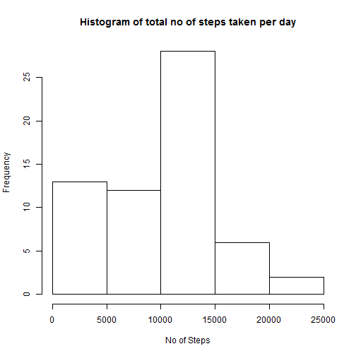
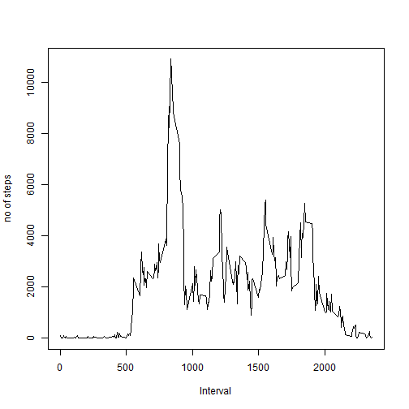
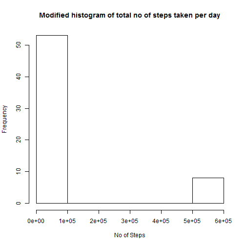
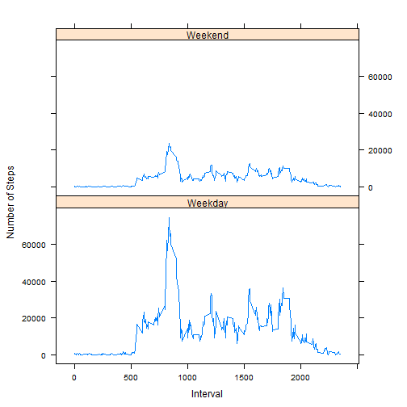

Activity Monitoring Assignment-1
=================================
1.Reading the data from the local directory into R

```r
activity <- read.csv("C:\\Users\\VIKASH\\Documents\\activity.csv", header = T)
```

Checking the class of the variables

```r
str(activity)
```

```
## 'data.frame':	17568 obs. of  3 variables:
##  $ steps   : int  NA NA NA NA NA NA NA NA NA NA ...
##  $ date    : Factor w/ 61 levels "2012-10-01","2012-10-02",..: 1 1 1 1 1 1 1 1 1 1 ...
##  $ interval: int  0 5 10 15 20 25 30 35 40 45 ...
```

Transforming the date variable from factor to POSIXlt (class for date and time)

```r
activity$date <- strptime(activity$date, format = "%Y-%m-%d")
```

2.Histogram of total number of steps taken each day

```r
steps_day <- aggregate(activity$steps, list(date = as.character(activity$date)), 
    sum, na.rm = TRUE, na.action = NULL)
hist(steps_day$x, xlab = "No of Steps", ylab = "Frequency", main = "Histogram of total no of steps taken per day")
```

 

Calculating the Mean and Median of total no of steps taken per day

```r
mn <- mean(steps_day$x, na.rm = TRUE)
md <- median(steps_day$x, na.rm = TRUE)
```

The mean is 9354.2295 and the median is 10395

3.Time series plot of 5 minute interval period and average no of steps taken across all day

```r
steps_interval <- aggregate(activity$steps, list(interval = activity$interval), 
    sum, na.rm = TRUE, na.action = NULL)
plot(steps_interval$interval, steps_interval$x, type = "l", xlab = "Interval", 
    ylab = "no of steps")
```

 

```r
mx <- steps_interval[steps_interval$x == max(steps_interval$x), 1]
```

Time Interval which has maximum no of steps on an average across all days is 835

4.Calculating no of NAs

```r
no_na <- sum(is.na(activity$steps))
```

The total no of NAs in the original activity dataset is 2304

5.We will use mean of that interval for imputing the missing values.

```r
new_activity <- activity
new_activity[is.na(new_activity)] = steps_interval$x
```

New histogramafter imputing missing values

```r
new_steps_day <- aggregate(new_activity$steps, list(date = as.character(new_activity$date)), 
    sum, na.rm = TRUE, na.action = NULL)
hist(new_steps_day$x, xlab = "No of Steps", ylab = "Frequency", main = "Modified histogram of total no of steps taken per day")
```

 

Calculating Mean and Median of new dataset

```r
new_mn <- mean(new_steps_day$x)
new_md <- median(new_steps_day$x)
```

The new mean is 8.4188 &times; 10<sup>4</sup> and new median is 11458
6.We will create a new factor variable in the dataset with two levels - "weekday" and "weekend" indicating whether a given date is a weekday or weekend day

```r
var_day <- weekdays(new_activity$date)
l <- var_day == "Saturday" | var_day == "Sunday"
var_day[l] <- "Weekend"
var_day[!l] <- "Weekday"
var_day <- as.factor(var_day)
new_activity <- cbind(new_activity, var_day)
```

A panel plot containing a time series plot (i.e. type = "l") of the 5-minute interval (x-axis) and the average number of steps taken, averaged across all weekday days or weekend days (y-axis)

```r
new_steps_interval <- aggregate(steps ~ interval + var_day, data = new_activity, 
    sum)
library(lattice)
```

```
## Warning: package 'lattice' was built under R version 3.0.3
```

```r
xyplot(steps ~ interval | var_day, data = new_steps_interval, type = "l", xlab = "Interval", 
    ylab = "Number of Steps", layout = c(1, 2))
```

 


